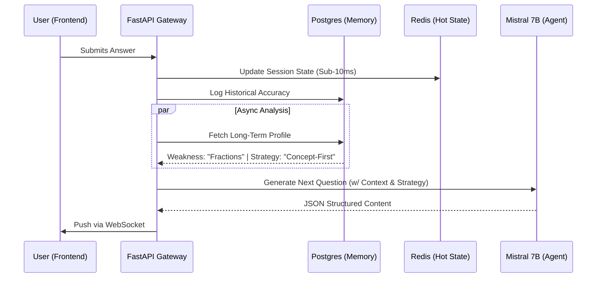

<div align="center">

# 🧠 AdaptIQ
### Autonomous Cognitive Learning Agent


<br />

**AdaptIQ** transforms static education into a **dynamic, bi-directional conversation**. By orchestrating local LLMs (Mistral 7B) with a stateful memory engine, it creates a personalized learning loop that adapts in real-time to user cognition.

[View Demo](#) · [Report Bug](#) · [Request Feature](#)
</div>

---

## ⚡ System Architecture

AdaptIQ utilizes an **event-driven architecture** to minimize latency and maximize context retention. Below is the data flow for a single learning cycle.



## 🚀 Core Capabilities

### 🧠 **Cognitive State Management**

Unlike stateless chatbots, AdaptIQ maintains a **persistent psychological profile** for every user.

* **Long-Term Memory:** Tracks mastery across topics using PostgreSQL.
* **Hot-State Caching:** Utilizes **Redis Pub/Sub** for real-time session tracking, reducing database read load by **~40%**.

### 🧬 **Adaptive Strategy Engine**

The system acts as an autonomous agent, switching pedagogical strategies based on live metrics:
| Threshold | Strategy | AI Behavior |
| :--- | :--- | :--- |
| **< 50% Accuracy** | `Concept-First` | Deconstructs problems; focuses on definitions & fundamentals. |
| **50-80% Accuracy** | `Standard` | Balanced difficulty; focuses on application of knowledge. |
| **> 80% Accuracy** | `Challenge-Mode` | Introduces edge cases; tests critical reasoning & speed. |

### 👁️ **Explainable AI (XAI)**

Black boxes are bad for learning. AdaptIQ features a **Transparent Decision Layer** in the UI, explicitly informing the user *why* the AI chose the current path (e.g., *"Detected rapid improvement in Algebra. Switching to Challenge Mode."*).

## 🛠️ The Tech Stack

<div align="center">
  
  [](https://skillicons.dev)

</div>

## 📂 Project Structure

```bash
adaptiq/
├── app/
│   ├── services/
│   │   ├── adaptive_engine.py    # The core logic for difficulty adjustment
│   │   ├── memory_service.py     # Long-term profile management (The "Brain")
│   │   └── llm_client.py         # Interface for Mistral 7B via Ollama
│   ├── routers/                  # WebSocket & HTTP Endpoints
│   ├── models/                   # SQLAlchemy Database Schemas
│   └── static/                   # Dashboard & Quiz UI (HTML/JS/CSS)
├── docker-compose.yml            # Orchestration for API, DB, and Cache
└── requirements.txt              # Dependencies

```

## ⚡ Quick Start

### Prerequisites

* **Docker & Docker Compose** installed.
* **Ollama** running locally (`ollama run mistral`).

### Deployment

1. **Clone the repository**
```bash
git clone [https://github.com/yourusername/adaptiq.git](https://github.com/yourusername/adaptiq.git)

```


2. **Ignite the System**
```bash
docker compose up --build -d

```


3. **Access the Interface**
* **Dashboard:** [http://localhost:8000/dashboard](https://www.google.com/search?q=http://localhost:8000/dashboard)
* **API Docs:** [http://localhost:8000/docs](https://www.google.com/search?q=http://localhost:8000/docs)


## 📊 Performance Metrics

| Metric | Result |
| --- | --- |
| **Latency** | Sub-100ms (WebSocket) |
| **Adaptation Speed** | Instant (Per-Question) |
| **DB Load Reduction** | ~40% (via Redis Caching) |

---

<div align="center">
<sub>Built with ❤️ by Rusheel Vijay Sable. Licensed under MIT.</sub>
</div>
